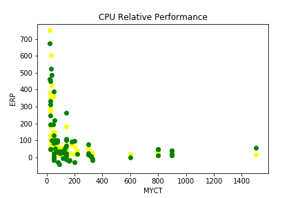

# Relative-CPU-Performance-Data---Analysis-
This multiple regression model predicts the estimated performance of the CPU based on the given data. Data is taken from  Faculty of Management: Tel Aviv University: Ramat-Aviv, Israel

